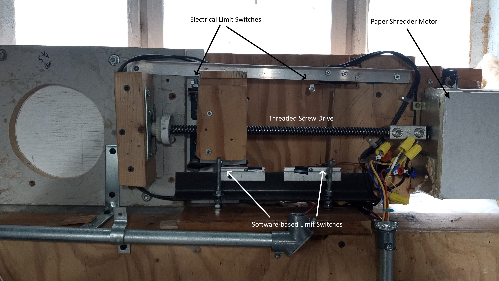

# Automatic Air Vent

These Arduino sketches operate a fresh air vent to resupply fresh air for exhaust fans and combustion air.
One sketch simply cycles the motor in each direction to allow for electrical debugging. The other two sketches
operate the vent in response to a furnace call for heat. Of these two, one sketch uses pull-up resistors on the 
limit switches, the other sketch uses pull-down resistors. 

As designed, the vent door opens when the thermostat calls the furnace for heat. The vent is composed
of a sliding door driven by a lead screw connected to a reversible motor. The door closes when there is no longer
a call for heat. 

Arduino's heat call pin should be connected to Normally Open (NO) side of the furnace switch/relay.
When there is a furnace call for heat, the furnace relay closes and heatCallReading will read LOW. 

There are two methods to prevent overtravel of the vent door. A roller switch (maxOpenLimitSw and maxClosedLimitSw
in the sketches) engage the lead screw's carriage at the limit of travel on each end. The roller switches signal the
microcontroller to stop the motor (by use of a relay) before the limit of travel. They also inform the Arduino of the
carriage's position when the call for heat is turned on and off.

In addition, vent door overtravel is prevented by two additional roller microswitches wired
in series with the relays. If the software-driven relays fail to stop the door for whatever reason, the
carriage would engage a secondary switch that shuts off power to the motor.

A DC-DC buck converter supplies 5v for the relay coils. The relays use an optocoupler for electrical isolation. The
Arduino supplies 5v VCC to the relays.

The signal from the furnace is sent from a solenoid relay, which can send "dirty" signals that need debouncing.
Debouncing time is lengthy in order to account for situations where the thermostat is accidentally switched
to "Heat" when manually operated.

## Materials Used:
* Reversible motor from paper shredder 
* Lead screw (linear actuator) from power reclining sofa
* Angle iron from bedframe
* Aluminum channel from window frame
* Wire coupler terminal butt connector with set screws
* 4 roller switches
* Composite decking for vent door
* 2 flexible polyethelene cutting boards for door frame
* Arduino
* 2-channel relay switch
* 24 VAC relay
* Various wood pieces
* Misc electrical supplies (wire caps, solder, shrink tubing, etc.)

## Design notes:
* The project used a paper shredder motor to drive the lead screw because it was available, has sufficient torque, and is already reversible.
  
* The software-based limit switches are mounted onto the aluminum channel. The channel is firmly seated on the angle iron by friction
yet is still adjustable horizontally.

* The software limit switches are vertically adjusted by the hex nuts and threaded rod to which the
angle iron is mounted.

* The outer frame for the sliding door is made from plywood lined with polyethelene to reduce friction. The design did not have
any noticable air leaks or condensation issues.

* The motor shaft and lead screw were joined together by a wire coupler with set screws.

* Reducing the electrical noise from the shredder motor was non-trivial. At various stages, the design used pull-up and/or pull-down resistors to
combat electrical noise. 

